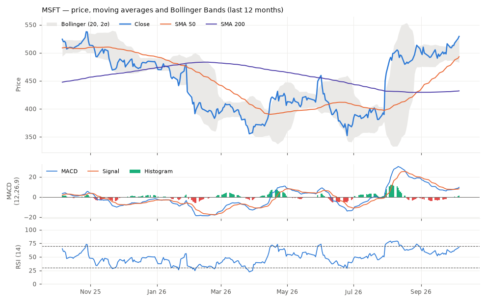

# Equity Research Brief — Microsoft Corporation (MSFT)
*As of 2026-10-06 · Generated by the CDAZZDEV Task 1 pipeline*

## Company Snapshot
| Metric | Value |
|---|---|
| Sector / Industry | Technology / Software - Infrastructure |
| Current price | 529.30 USD |
| 52-week range | 348.54 – 549.20 (-3.6% from high) |
| P/E ratio | 29.26 (trailing (yfinance)) |
| Market cap | 3.93T USD |
| YTD return | +10.14% |

## Technical Outlook

- Trend: price +7.34% vs SMA50, +22.52% vs SMA200 (golden cross 26 sessions ago).
- Momentum: RSI(14) 68.0; MACD 9.57 vs signal 8.14, histogram +1.44 (5-day change +1.80).
- Volatility: Bollinger %B 1.06, bandwidth 8.8% (35th pct of 6m); 20d realised vol 20.7% annualised.
- Rule-based momentum composite: **Strong Bullish** (score +0.84).

## News Sentiment Summary
Overall sentiment **positive** (score +0.65 on −1..+1) across 15 headlines — 10 positive, 4 neutral, 1 negative; mean confidence 0.79.

**Top headlines**

1. **[POSITIVE · 0.92]** MSFT Stock Nears All-Time High: Xbox Moves To Secure Exclusive Rights To Stream Grand Theft Auto VI, Report Says *(unknown)* — Securing exclusive GTA VI streaming rights should boost Xbox revenue and support the stock’s upward trajectory.
2. **[POSITIVE · 0.92]** As Microsoft Adapted To AI Megatrend, Sales, Profits Surged. MSFT Leads 9 Joining IBD Best Stock Lists *(Investor's Business Daily)* — Surging sales and profits plus multiple IBD best‑stock list inclusions signal strong performance, likely boosting the stock.
3. **[POSITIVE · 0.92]** Jim Cramer: Microsoft’s “Monster” Data Center Play Is Starting to Pay Off *(unknown)* — Cramer’s comment signals that Microsoft’s data‑center investments are yielding results, likely boosting earnings outlook.

## Recommendation: **HOLD** (conviction 65%)
Microsoft is trading well above its 50‑day and 200‑day moving averages, and a recent golden cross together with a rising MACD histogram confirms a robust uptrend. However, the RSI of 68 and a %B above 1 signal that the rally may be nearing exhaustion, raising the risk of a short‑term pullback. The upbeat news sentiment reinforces the bullish bias but does not fully offset the overbought technical warnings. Given the mixed signals, a neutral stance is prudent for the next 1‑3 months. The overall conviction reflects moderate confidence in the current trend while acknowledging downside risk.

**Indicator interactions considered**

- *sma_50 + sma_200 + macd* → bullish: Price is well above both short‑ and long‑term averages and MACD is positive with a rising histogram, indicating a strong uptrend with intact momentum
- *rsi_14 + bb_percent_b* → bearish: RSI is near the overbought threshold and %B is above 1, meaning the price is trading above the upper Bollinger band and may be exhausted
- *news_sentiment + trend_indicators* → bullish: Positive news sentiment (+0.65) aligns with the bullish trend signals, adding confirmation to the technical picture

**Key risks to the call:** RSI crossing into overbought territory and price above the upper Bollinger band could trigger a correction; Adverse earnings or macro‑economic developments could reverse the positive sentiment; Unexpected negative news could outweigh the current bullish technical setup

*Signal source: llm (openai/gpt-oss-120b); horizon 1-3 months.*

## Risk Disclaimer
> This report was generated automatically by a machine-learning pipeline for educational and assessment purposes only. It is not investment advice, an offer, or a solicitation to buy or sell any security. Technical indicators are backward-looking, LLM output can be wrong or incomplete, and news sentiment is inferred from headlines only. Past performance does not guarantee future results. Consult a licensed financial adviser before making any investment decision.
